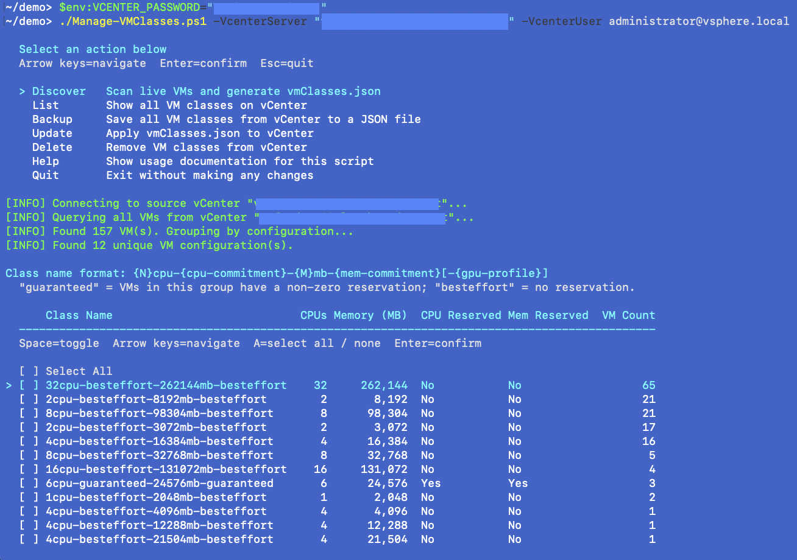
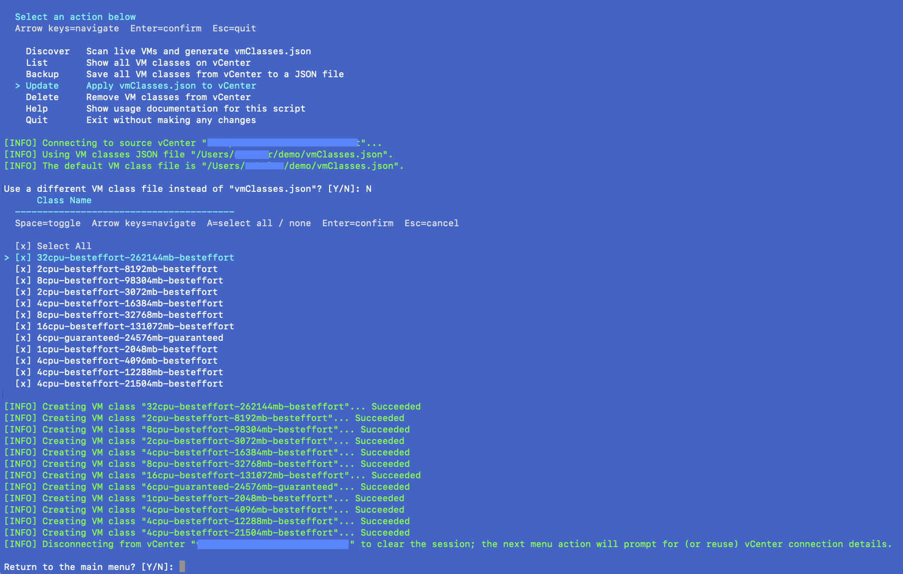

# Powershell Scripts for VMware vSphere Kubernetes Service (VKS)

## First Utility - Manage VM Classes

Easily export your common VM configurations into VM class definitions.  VM classes allow a user to define the such resources include CPU, memory, and GPU within a Kubernetes context.  This script simplifies the process by finding the most common vSphere VM configurations in a vCenter and then automatically constructing a simplified JSON definition that can be imported into the same or a different vCenter.

## Latest Release

[Download 1.0.0 with Documentation]( https://github.com/vmware/powershell-vks-utilities/releases/latest/download/Manage-VMClasses.zip)
## Prerequisites

- PowerShell 7.4 or later [download](https://learn.microsoft.com/en-us/powershell/scripting/install/install-powershell).
- VCF PowerCLI 9.0+ [download](https://developer.broadcom.com/powercli/installation-guide).
- Network access to vCenter.
- A user with the following rights, at minimum, to the source vCenter: Read-only (at vCenter root level).
- A user with the following rights, at minimum, to the destination vCenter: Namespaces.Configure and Namespaces.ListAccess.

## Screen Short showing TUI for Discovery

## Screen Short showing TUI for Import

## Example Usage

[Examples](Manage-VMClasses/EXAMPLES.md)

## Detailed VM Manage Readme

[Detailed Readme](Manage-VMClasses/README.md)
